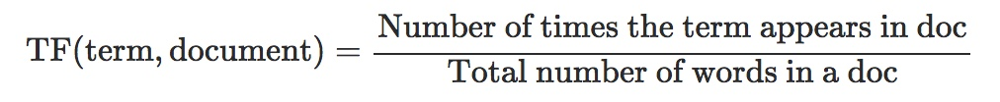
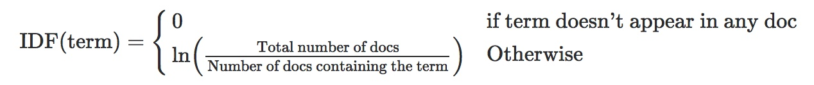

# Search Engine

## Previously Implemented Data Structures
* ChainingHashMap
* ChainingHashSet
* DoubleLinkedList
* ArrayDictionary

## 4-Heap
* Represented the heap as an array and implemented a min heap.
* Implemented the topK Search algorithm (runs in O(NlogK) time).
* Utilized JUnit tests to test for accuracy and edge cases.

### Overview
We were given the front-end code for the search engine. For this project, we will be working with a few snapshots of the web and these snapshots vary in size. Search Engines like google use several algorithms to produce the results. For this project, we will be implementing TF-IDF with Cosine Similarity and PageRank.

### Term Frequency (TF) and Inverse Document Frequency (TF-IDF)
TFIDF is a numerical statistic that reflects how important a word is in a document. The TFIDF score increases proportionally to the number of times a word appears in a document. It is offset by the number of times the word appears in the whole document set.

The motivation for computing the term frequency (TF) is pretty intuitive; we want to eliminate the documents that do not contain the words from the query. In addition, we will also store the term frequency (number of times a word appeared in a document) of each word in the query.

#### Computing Term Frequency (TF)

However, some words such as 'the' appear in a lot of documents. For these words, TF will incorrectly emphasize the importance of the documents which have a high frequency for 'the'. Hence we need an Inverse Document Frequency (IDF) score that diminishes the significance of the words that occur in a lot of documents and increases the weight of the terms that are seen rarely.

#### Computing Inverse Document Frequency (TF-IDF)

### Implementing Cosine Similarity
This is the logic that determines whether a document is related to a query. We computed the cosine similarity between the document vector and the query vector. We did this by comparing the TF-IDF vector for a query against all the document TF-IDF vectors. Then we computed how similar the query vector is to each document by exploiting properties of the cosine function and the dot product.

### PageRank: Intuition
PageRank works by ignoring the user's query and instead computing the relative "importance" of a webpage based on what webpages link to it. That is if many webpages link to webpage A, then many users are likely to reach this page. Then we can conclude that webpage A is reputable. Similarly, if webpage A has many visitors and webpage A only links to webpage B, we can assume that many users are going to click on the link to webpage B. Now webpage B will share some of the importance of webpage A.
